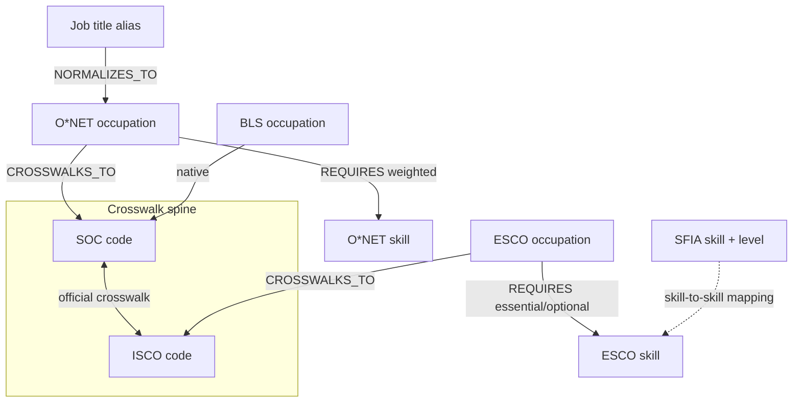

# Taxonomies — profiles and the unified model

> The output of Sprint 1, turned into a design contract. Five mentees each
> explored one reference taxonomy; this document is what those five
> explorations become when read together.
>
> **What decisions were made and why** lives in
> [ADR-0003](../decisions/0003-taxonomy-data-sources.md). This document
> describes **what we build**. Access terms verified 2026-07-19.

## At a glance

| Taxonomy | Status | Licence | What it uniquely contributes |
| --- | --- | --- | --- |
| **O\*NET** | ✅ Adopted — the backbone | CC BY 4.0 | Weighted skill edges; tasks; native RDF; 57,543 lay job titles |
| **BLS / SOC** | ✅ Adopted | US public domain | The occupation spine every other source crosswalks into; employment projections |
| **ESCO** | ✅ Adopted | Free with attribution (EC Decision 2011/833/EU — *not* Creative Commons) | 28-language labels; the European occupation view |
| **SFIA** | ⚠️ Structure only, never bundled | Free for internal use; redistribution is fee-bearing | Responsibility levels 1–7 — a dimension no other source has |
| **Sweden JobTech** | ✅ Adopted | **CC0** | Live job-postings signal — what people are actually hiring for, right now |
| **Lightcast** | ❌ Not adopted | Non-commercial; AI use requires a written contract | *(was: job-title normalization, monthly freshness)* |

Sprint 1 slices, one per taxonomy, live in
[`TA-lab/mentees/<handle>/sprint-01/`](https://github.com/LFX-Talent-Angels/TA-lab/tree/main/mentees).

## Profiles

### O\*NET — the weighted backbone

US Department of Labor. Structure: occupations keyed by **O\*NET-SOC code**
(`15-1252.00`), linked to tasks, skills, and software. The first seven
characters of an O\*NET-SOC code **are** the SOC code — the crosswalk to BLS is
free.

What makes it the backbone: **62,580 weighted skill-occupation edges** across
*Essential Skills* (17,880) and *Transferable Skills* (44,700), each rated on
both **Importance** and **Level** scales and carrying sample size, standard
error and 95% confidence bounds. Parallel weighted files exist for Knowledge,
Abilities, Work Activities, Work Context, Work Styles and Task Ratings. No other
open source in our set has survey-derived weights with published statistics.

It also ships **native RDF** (JSON-LD, Turtle, N-Triples, RDF/XML), so it drops
into a triple store or Neo4j via n10s without a parsing layer.

*Schema caution.* The 30.x restructure renamed files: `Skills.txt` no longer
exists (split into Essential/Transferable), and *Alternate Titles* is now **Job
Titles**. Work Styles moved off Importance 1–5 to WI (−3..+3) and DR (0–10).
Code written against older layouts breaks. Verify rating scale bounds on ingest
rather than assuming.

*Attribution (required, verbatim form):*

> This page includes information from the O\*NET 30.3 Database by the U.S.
> Department of Labor, Employment and Training Administration (USDOL/ETA). Used
> under the CC BY 4.0 license.

Use "O\*NET" as an adjective ("O\*NET data") — never possessive or plural.
Download: <https://www.onetcenter.org/database.html> ·
Licence: <https://www.onetcenter.org/license_db.html>

### BLS / SOC — the occupation spine

US Bureau of Labor Statistics. The **Standard Occupational Classification** is a
four-level hierarchy encoded in a single 6-digit code: major group (2 digits) →
minor group (3rd) → broad occupation (4th–5th) → detailed occupation (6th). So
`15-1252` decomposes to `15-0000` → `15-1000` → `15-1250`. The hierarchy is
derivable in code; no lookup table needed.

Its role in our graph is structural: **SOC is what the other taxonomies
crosswalk into**, which makes BLS the hub even though it carries no skills.
It also supplies Employment Projections — a slower-moving but authoritative
demand signal, and our substitute for the market freshness Lightcast provided.

US federal data, public domain. <https://www.bls.gov/emp/>

### ESCO — the multilingual European view

European Commission. Three pillars: Occupations (built on **ISCO-08**), Skills
and Competences, and Qualifications. Built as linked open data on RDF/OWL/SKOS,
so concepts carry `skos:prefLabel` / `skos:altLabel` in 28 languages and
`skos:broader` / `skos:narrower` hierarchies. Current version v1.2.1 (published
2025-12-22). The public API requires no key.

**ESCO is structurally binary.** Its 126,051 skill edges use exactly two
predicates — `hasEssentialSkill` and `hasOptionalSkill` — and the link objects
carry no numeric field. There is nowhere to put a weight. Any weighting we
apply to ESCO edges is *our modelling decision* and must be labelled as such.

Two practical notes from Sprint 1: **Neosemantics (n10s) is not compatible with
Neo4j AuraDB's managed architecture**, so RDF ingestion there needs the Data
Importer or a self-hosted instance. And the Qualifications pillar is sparse,
which limits qualification-aware learning journeys.

Free to use with attribution under Commission Decision 2011/833/EU. **It is
CC-BY-*like* but not Creative Commons — do not label it CC BY.** Required
attribution: *"This service uses the ESCO classification of the European
Commission."* <https://esco.ec.europa.eu/en/use-esco/download>

### SFIA — responsibility levels, structure only

SFIA Foundation. Structure: `Category → Subcategory → Skill → Skill level`.
Skills carry short codes (`ITSP`, `PROG`, `TEST`) and exist at one or more of
**seven responsibility levels** — Follow, Assist, Apply, Enable, Ensure/Advise,
Initiate/Influence, Set strategy/Inspire/Mobilise. That vertical axis is SFIA's
unique contribution: no other source in our set models how a skill's meaning
changes with seniority.

**SFIA has no occupations.** It is a pure skills-and-levels framework, so it
joins the other taxonomies through skill-to-skill mappings, never occupation
crosswalks.

⚠️ **Licence boundary — read before ingesting.** SFIA's free licence covers
personal and internal use. Redistribution to other organisations is fee-bearing,
and copying is prohibited without written authorisation. Our repositories are
public and Apache-2.0, so:

- **Store:** skill codes, skill names, level numbers, category structure.
  These are facts.
- **Never store:** SFIA's descriptive text for skills or levels. That is
  protected expression.
- **Fetch at runtime:** descriptions are retrieved by users holding their own
  SFIA access, keyed by the codes in our graph.

**This is the general pattern for any licence-gated source: store the pointer,
fetch the payload at runtime.** <https://sfia-online.org/en/about-sfia/licensing-sfia>

### Sweden JobTech — live market signal

Swedish Public Employment Service (Arbetsförmedlingen). Unlike the other four,
this is not a curated classification — it is **primary evidence**: what
employers actually advertised, when, and in what words.

What it offers (verified 2026-07-19 at
<https://data.jobtechdev.se/dataset/job-ads>):

- **~6.9 million job advertisements since 2006** as a bulk file.
- **JobStream API** — real-time access to published postings with change
  notifications.
- **Historical Job Postings API** — 2016 onward, "enriched with competency
  data".
- **Job Search API** and **JobAdLinks** for structured querying.

**All distributions are CC0** — public domain dedication, no attribution
required, no restriction on commercial or AI use. It is the cleanest licence in
our set, and cleaner than anything Lightcast ever offered.

Its role is to answer the questions a curated taxonomy structurally cannot:
which skills are being asked for together, which are rising, how employers
actually phrase a role. That is the capability we lost with Lightcast.

⚠️ **Two honest limits.** First, it is **one country** — Swedish demand is not
global demand, and any agent surfacing "what's in demand" must name whose market
it means. Second, reports that the JobTech taxonomy carries `esco-occupation` /
`esco-skill` concepts are **unverified** (their taxonomy site was unreachable
when this was written). If true, alignment with ESCO is nearly free; if not,
mapping postings to our graph is real work. **Test this before scoping any
feature on it.**

### Lightcast — not adopted

Kept here because the reasoning is worth preserving, not because we use it.
Programmatic access runs $41,000–50,000/yr; the licence excludes commercial use
and requires a written contract for *"artificial intelligence purposes"*; and
the free API tier ended 2026-02-13 with three days' notice. Full evidence in
[ADR-0003](../decisions/0003-taxonomy-data-sources.md).

Its best idea is worth replicating: a **job-title normalization layer** mapping
~75,000 messy real-world titles to canonical occupations. We rebuild that from
open sources — see below.

## The unified model

Five taxonomies, one graph, no semantic fusion.

**Three rules make it work.**

**1. Every node carries `source` and `source_id`.** `source` names the taxonomy
(`onet`, `bls`, `esco`, `sfia`); `source_id` is that taxonomy's own identifier.
Nodes never share an identity across sources. This is load-bearing, not
cosmetic: SFIA's skill code `ISCO` (Information systems coordination) is
unrelated to the ILO's ISCO occupation classification used by ESCO.

**2. Crosswalks are edges, not merges.** A `CROSSWALKS_TO` edge points at a
`CrosswalkCode {scheme, code}` node. We never fuse two source nodes into one.
Fusing loses provenance and commits us to semantic equivalence claims we cannot
defend; edges let an agent traverse between taxonomies while still knowing where
each fact came from.

**3. Weights carry their provenance.** An O\*NET edge weight is a survey
statistic with a standard error. An ESCO edge has no weight at all. Anything we
compute ourselves is labelled as ours. The Evaluator will rank paths using these
numbers, and a ranking that silently mixes measurement with inference is worse
than no ranking.

### Replacing what Lightcast did

| Capability | How we rebuild it | Status |
| --- | --- | --- |
| Job-title normalization | **O\*NET Job Titles** — 57,543 lay titles mapped to O\*NET-SOC, CC BY 4.0 — plus **ESCO altLabels** (30,417 English alternative labels across 28 languages), plus **JobBERT-v3** (MIT licence, trained on ~21M title-skill pairs in EN/ES/DE/ZH) for semantic matching of titles never seen before | Covered, arguably better |
| Weighted skill edges | **O\*NET Essential + Transferable Skills** — 62,580 edges with Importance *and* Level, plus published statistics | Covered, more rigorous |
| Market freshness | **Sweden JobTech** — ~6.9M ads since 2006, CC0, live JobStream API — for actual hiring signal; **BLS Employment Projections** for authoritative slow signal | Covered for one country; no open global equivalent exists |

The recommended Locator resolution chain: exact match against a merged
O\*NET + ESCO alias table → JobBERT-v3 nearest-neighbour with a confidence
floor → fail loudly rather than guess. Lexical search alone does not solve
"ML Ninja"; embeddings do.

## Ingestion rules

- **Pinned snapshots, not live endpoints.** Every source is vendored at a fixed
  version with its retrieval date. Sources disappear: Lightcast cut access with
  three days' notice, and Nesta's Open Jobs Observatory ended in October 2025
  with its S3 bucket now returning `NoSuchBucket`.
- **Third-party data in its own tree with its own notice.** Licensed data is not
  relicensed under Apache-2.0. Only our code is.
- **Attribution recorded at ingest**, per the exact wording in each profile
  above — not reconstructed later from memory.
- **Licence-gated sources store pointers, not payloads.**

## Not in scope, deliberately

**Credentials are ours to build.** The obvious move for a Learning Tokens Lab
project would be to adopt a credential taxonomy — Credential Engine's CTDL or
similar — to link skills to qualifications. We decline that dependency. Proof of
Learning is designed by this project, on mechanisms we choose; the credential
layer is our **output**, not a third party's vocabulary. The taxonomies answer
questions about skills, tasks and occupations. What a learner earns for
traversing them is our design surface, and we keep it unencumbered.

**Other classifications, open to explore, none adopted.** Worth a look only if a
concrete need appears: the UK **Standard Skills Classification** (OGL v3.0,
carries crosswalks but sign-in gated, and its weights are LLM-generated with a
documented reproducibility failure); **Canada's OaSIS** (OGL-Canada, ~222k
weighted edges, but an O\*NET transform); national schemes closer to our
contributors such as **India's NCO** and **Mexico's SINCO**; and thematic
frameworks like the EU's **DigComp**, **GreenComp**, **EntreComp**, or NIST's
**NICE Framework**. Adding an occupation taxonomy that already crosswalks to SOC
or ISCO buys coverage we largely have.

## Open items

- **Graph store still unresolved.** All four Sprint 1 mentees used Neo4j and
  this document assumes Cypher/RDF idioms, but `SYSTEM.md` still lists the
  choice as open and no ADR records it. O\*NET and ESCO both shipping native RDF
  is now a substantive input to that decision.
- **O\*NET's postings vendor** may be Lightcast (per its 2022 methodology
  report, unconfirmed for 2026). If so, O\*NET's *Hot Technology* flags are
  downstream of a pipeline that just closed.
- **JobTech's ESCO alignment is unverified** — confirm before scoping any
  feature that assumes Swedish postings map cleanly onto our graph.
